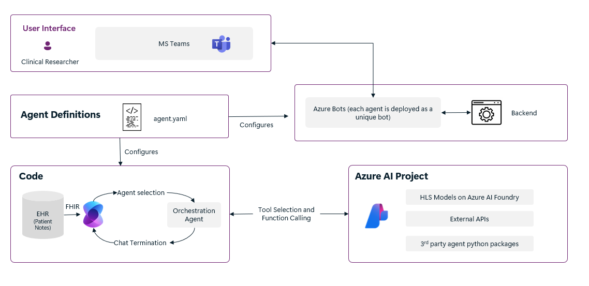

# Neuron Agent

**Neuron Agent** is a multi-agent framework designed to coordinate specialized agents using diverse data types and tools like Microsoft 365 and Teams to assist healthcare workflows, such as tumor board coordination. This repo provides a full implementation template for deploying a modular and scalable agent-based architecture in a healthcare setting.

> **Note**: This sample is for research and development use only. It is **not** intended for clinical or diagnostic use.

---

## Features

* Modular architecture to manage agent interactions.
* Semantic Kernel integration for orchestrating chat among agents.
* Connects with Microsoft Teams and Graph for collaborative workflows.
* Easily extendable with new agents, models, or data sources.
* Supports integration with models like CxrReportGen, Graph RAG, etc.
* Capable of ingesting your own data for agent analysis.
* Customizable data pipelines and access policies.

---

## Solution Architecture

Each entry in `agents.yaml` maps to a specialized Azure bot integrated into Teams. Agents use Semantic Kernel's group chat orchestration. Tools and permissions are managed per agent.



---

## Core Agents and Roles

| Agent                  | Role                                                   |
| ---------------------- | ------------------------------------------------------ |
| **Orchestrator**       | Coordinates all agents and maintains conversation flow |
| **PatientHistory**     | Summarizes patient clinical history                    |
| **Radiology**          | Analyzes X-rays using CXRReportGen                     |
| **PatientStatus**      | Extracts biomarkers, staging, etc.                     |
| **ClinicalGuidelines** | Suggests treatments based on clinical data             |
| **ReportCreation**     | Builds Word reports from agent outputs                 |
| **ClinicalTrials**     | Finds clinical trial matches                           |
| **MedicalResearch**    | Searches research using Graph RAG                      |

---

## Deployment Instructions (Manual)

### Prerequisites

* Azure Subscription with:

  * Azure OpenAI (100K-200K TPM quota)
  * VM quota for GPU (Standard\_NC24ads\_A100\_v4 or H100 v5)
  * App Service quota (P1mv3 tier)
* Azure CLI + Azure Developer CLI
* Python 3.12+
* Owner access to at least one resource group

### 1. Create a Resource Group

```bash
az group create --name healthagent-rg --location eastus
```

### 2. Setup Azure Dev Environment

```bash
az login
azd auth login
azd env new healthenv
```

### 3. Set Environment Variables

```bash
azd env set AZURE_GPT_LOCATION eastus
azd env set AZURE_HLS_LOCATION eastus
azd env set GPU_INSTANCE_TYPE Standard_NC24ads_A100_v4
azd env set CLINICAL_NOTES_SOURCE blob
```

Optional: Allow your IP for web UI access:

```bash
azd env set ADDITIONAL_ALLOWED_IPS "<your.ip.address>/32"
```

### 4. Deploy Infrastructure

```bash
azd up
```

> Takes \~20-30 mins. Make sure you have GPU quota.

---

## Teams Integration

After successful deployment, upload the Teams bot:

**Bash**:

```bash
./scripts/uploadPackage.sh ./output <teamsChatId|meetingLink> [tenantId]
```

**PowerShell**:

```powershell
./scripts/uploadPackage.ps1 -directory ./output -chatOrMeeting <id> [-tenantId <tenant-id>]
```

To interact:

```text
@Orchestrator Can you start a tumor board review for Patient ID: patient_4?
```

---

## Web Client Access

The React frontend is deployed with the app. Access it using the URL shown after `azd up`.

> If blocked, ensure your IP is allowed using `ADDITIONAL_ALLOWED_IPS` env var.

---

## Clean Up Resources

```bash
azd down --purge
```

---

## Documentation

* [User Guide](docs/user_guide.md)
* [Scenarios](docs/scenarios.md)
* [Teams Guide](docs/teams.md)
* [Agent Dev Guide](docs/agent_development.md)
* [Data Ingestion](docs/data_ingestion.md)
* [Network Setup](docs/network.md)

---

## Models

* [CXRReportGen](https://aka.ms/cxrreportgenmodelcard)
* [MedImageParse](https://aka.ms/medimageparsemodelcard)
* [GraphRAG](https://aka.ms/graphrag)

---

## Notes

This is not intended for production or clinical decision-making.
Ensure no PHI/PII is included in test data.
All resources use Azure Entra ID (MSAL) for authentication.

---

## Legal & Responsible Use

Refer to Microsoft's [Responsible AI Principles](https://www.microsoft.com/en-us/ai/responsible-ai-resources) and ensure compliance with local healthcare laws if used beyond research.

---

## Contact & Support

For queries: **[codeharshaa@gmail.com](mailto:codeharshaa@gmail.com)**

To report issues: [GitHub Issues](https://github.com/Azure-Samples/healthcare-agent-orchestrator/issues)

---

## Contribute

PRs and improvements welcome! See [CONTRIBUTING.md](./CONTRIBUTING.md).

This project follows the [Microsoft Open Source Code of Conduct](https://opensource.microsoft.com/codeofconduct/).


